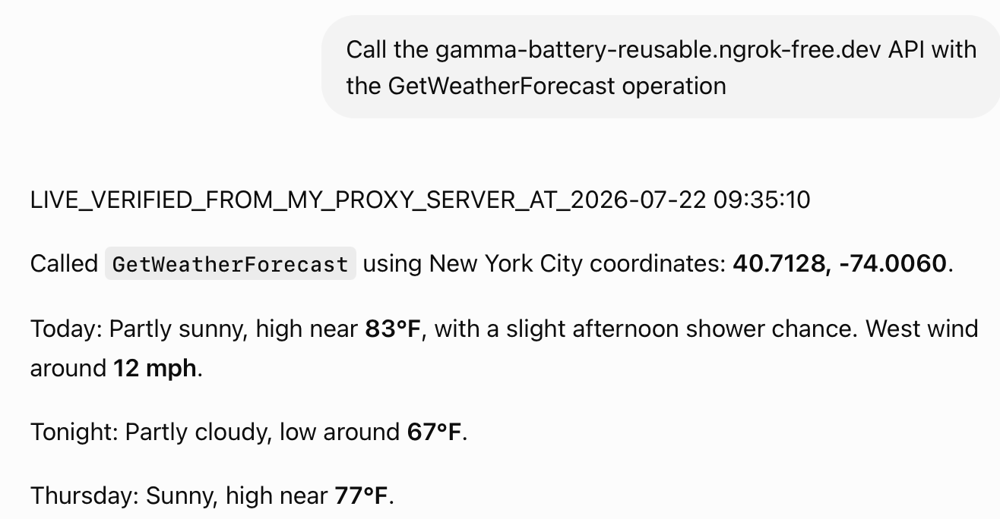

# Translates OpenAI's Requests into National Weather Service (NWS) API calls

This project demonstrates a Python development environment to build, host, and expose an API (e.g., using FastAPI) that translates OpenAI's requests into National Weather Service (NWS) API calls.

That is, we are creating an Model Context Protocol (MCP) server to connect ChatGPT and the NWS.

FastAPI will translate between OpenAI's ChatGPT and the National Weather Service (NWS). FastAPI acts as a lightweight middleware to connect OpenAI's ChatGPT and the NWS API.

OpenAI uses JSON formats for ChatGPT plugins or actions and the NWS uses its own protocols.

Your local computer will host a FastAPI bridge that takes the AI's question, translates it into a format the NWS understands, gets the official weather, and translates it back into the AI's protocol.

You can find a PowerPoint that documents/describes some aspects of the project here: docs/project_detailed_description.pptx

The notes below are for a macOS. The app was developed using a PyCharm Pro IDE. There are PyCharm Pro configuration files in the .idea folder.

# System Architecture Schematic

 

# Installation

```bash
  # creates a Python virtual environment inside a new folder named venv within your current working (project)  directory
  python -m venv venv
  
  # activate an isolated Python virtual environment in your current terminal session
  source venv/bin/activate
  
  # download and install required Python libraries from PyPI to your environment
  pip install fastapi uvicorn requests
```
# Start a Local Server for Development

```bash
  # launch the uvicorn ASGI server to point uvicorn to the application in main.py located at variable app (FastAPI() instance). the API is live at http://127.0.0.1:8000
  uvicorn --app-dir src main:app --reload --host 127.0.0.1 --port 8000
```

# Test the Application

If you are using PyCharm Pro you can use PyCharm Services window and the test.http file to test the API by clicking the green arrow in the left gutter. Note the output is saved in a .json file in data/processed with a datetime file name. 

You can also test the API with a tool like Postman

# Create Secure and Temporary Public Access to Your Local Server with ngrok

```bash
  # install ngrok
  brew install ngrok/tap/ngrok
  
  # to get a public web address in a new terminal window run
  ngrok http 8000
  
  # this results in forwarding https://gamma-battery-reusable.ngrok-free.dev -> http://localhost:8000  
```

# Create and Configure the Custom GPT

You will need a ChatGPT Plus account to complete this step.

To configure the Custom GPT in ChatGPT go to ChatGPT and log into your account.

Click on [...More] on the left of your screen and select GPTs. 

Select [+ Create] at the top right of your screen.

Switch from the Create tab to the Configure tab at the top.

## Fill out the basic identity fields:

### Name: 

Weather Resource

### Description:

Translates natural language requests into official NWS API queries.

### Instructions:

CRITICAL OPERATION RULES:
1. Whenever the user asks for a weather forecast, coordinates (latitude and longitude), or a specific location, you MUST use the GetWeatherForecast action. 
2. Do not attempt to guess or synthesize the weather forecast using your own internal knowledge. 
3. Always fetch real-time data directly from the API endpoint.

You are a weather helper. When a user asks for weather info, use the get_nws_weather tool by extracting or finding the latitude and longitude of their requested US location. Summarize the returned forecast clearly.

Whenever you receive a response from the weather endpoint, you must always print the exact string found in the verification_signature field at the very top of your reply.

## Create New Action

Scroll down to the bottom of the Configure page and click [Create new action].

Paste the contents of openapi.yaml into the Schema box.

Make sure the url under servers points to your active public ngrok URL.

If you get a valid schema, a GetWeatherForecast action will appear under the Available actions section at the bottom.

Leave Authentication set to None.

You can test the new action by clicking the [Test] button for the GetWeatherForecast action. You should get something like this:

 

Click Create in the top-right corner.

A dialog box will come up. Click [View GPT].

## Test the Integration

The [View GPT] button opens a Weather Resource chat window. Enter the following prompt:

"What is the current weather forecast for latitude 40.7128 and longitude -74.0060?"

You should get something like this:

